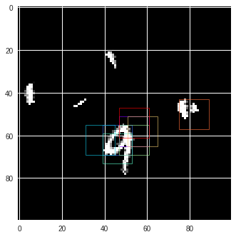

# Dynamic-Capacity-Networks
An implementation of the Dynamic Capacity Networks paper in Pytorch (paper at https://arxiv.org/abs/1511.07838)

Based on the tensorflow implementation of the paper found at https://github.com/beopst/dcn.tf.

Used mainly on cluttered-MNIST data set that can be found at https://github.com/deepmind/mnist-cluttered.

### Features:
- Code to compute the receptive field of the coarse and fine model that allow
to make quick changes to patch sizes and to the layers of the models.
- Visualization of the salient patches 

### Example of visualization of salient patches

### To do: 
- Experiment on other data sets
- Evaluate results for all models and compare them to the paper's results
